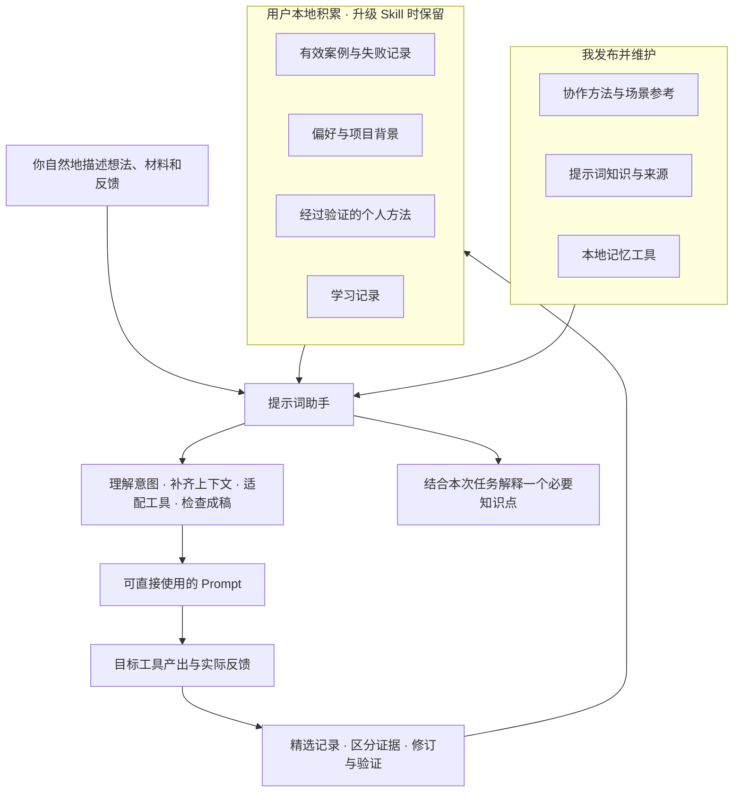

# 提示词助手

**把想法说明白，把好用的经验留下来。**

[English](README.md) · `prompt-assistant` · v0.1.0 · MIT

有时你已经知道想做什么，只是不知道怎么说。有时提示词看起来很完整，生成结果却总差一点。还有些经验，你不想换一个任务就重新解释。

这个 Skill 让你的 Agent 帮你整理想法、写出可直接交给目标工具的 Prompt，并把值得复用的案例、明确偏好和真实反馈留在本地。下次遇到类似任务，再参考这些积累。需要时，它也会用当前案例解释一个有用的方法，让你逐渐更会表达。

## 安装后这样用

不需要背格式，也不用先选模式：

```text
用 $prompt-assistant 帮我写一段提示词。我想给自己的短视频做一段开场动画，只有一点模糊想法，你边问边帮我整理。
```

```text
把我们刚才确认的内容整理成一段独立的 Prompt，我要交给另一个工具。别漏掉已经决定的限制，也别改掉我的观点。
```

```text
这是我用过的提示词和生成结果。角色大体对了，但镜头运动不符合预期，帮我找出应该改哪里。
```

```text
找一下我上次满意的封面提示词。这次还是同一个账号，不过想换一个场景。
```

一次简单使用通常得到一份可复制的提示词，以及确有必要的材料或参数说明。你说“只给 Prompt”，它就省略教学解释。直接要求 Agent 写代码或生成图片，仍按原任务执行；这个 Skill 服务于提示词的创作和改进。

## 它如何逐渐了解你

第一次使用，助手会说明精选案例和偏好会在本地积累。之后你不必每次说“收藏”，但实际结果仍需要你带回来，或者由 Agent 通过已连接的工具查看。

| 你说的话 | 留下什么 |
| --- | --- |
| “这段可以，我先拿去试试。” | 被认可的提示词；不会标记为生成成功 |
| “试过了，角色没变，但镜头乱动。” | 对应版本的混合结果，以及哪些部分有效、哪些失败 |
| “这个账号以后的封面都不要字。” | 该账号的长期偏好；不影响其他项目 |
| “这次不要字。” | 只约束本次任务 |
| “这个方法在另一个任务也有效。” | 新的验证依据；核对条件后再决定能否形成个人方法 |
| “只给我成稿，别解释。” | 本次省略教学；说“以后关闭教学”才持久改变设置 |

记忆分成五类：**案例、偏好、项目背景、个人方法、学习记录**。提示词的实质修订保存为新版本，实际反馈关联到它对应的版本。明确偏好及时更新；推测保持暂定。个人方法要有两个不同任务的实际结果与对照证据才启用，有反例时复查。

“越用越懂你”依赖于有价值的反馈和正确的检索。它不会因为存得更多，就保证每次输出更好；两项任务的验证也只是有限范围的采用门槛。

## 结构



初始知识覆盖上下文可见性、目标与验收标准、示例对比、改动与保持项、任务分解、工具和材料的作用、反馈对照及记忆范围。每项都包含机制、用法、边界和来源。理论解释按任务需要出现，完整目录见 [知识与教学](references/knowledge-and-coaching.md)。

## 安装

把下面这段发给支持安装 Skill 的 Agent：

```text
请安装这个提示词助手 Skill：
https://github.com/Flow-east/Skills/tree/main/prompt-assistant
```

安装后可显式输入 `$prompt-assistant`，也可直接说“帮我写一段给 AI 的提示词”；自动触发是否可用由宿主决定。如果安装后尚未发现 Skill，在新会话中再试。

手动安装到 Codex 的技能目录时，复制**整个文件夹**，不能只复制 `SKILL.md`。以下用于首次安装，遇到同名目录会停止：

```bash
git clone https://github.com/Flow-east/Skills.git floweast-skills
python3 - <<'PY'
import os
from pathlib import Path
import shutil
source = Path('floweast-skills/prompt-assistant')
destination = Path(os.environ.get('CODEX_HOME', str(Path.home() / '.codex'))) / 'skills/prompt-assistant'
destination.parent.mkdir(parents=True, exist_ok=True)
shutil.copytree(source, destination)  # 已存在则报错，不覆盖旧安装
print(destination)
PY
```

需要固定版本时，使用 Git Tag `prompt-assistant-v0.1.0`。升级时只更换安装的公共 Skill 文件夹，保留个人数据目录。也可以下载该版本的 `prompt-assistant-v0.1.0.zip` 后由 Agent 安装。

## 数据与控制

完整功能需要宿主能读写持久目录、运行 **Python 3.9+**。脚本只用标准库，不需要另设模型 API Key、向量数据库或服务器。没有持久文件工具时，仍可在当前对话内写和改 Prompt，但无法跨会话积累。

默认个人数据位置：

- macOS / Linux：`~/.local/share/prompt-assistant/`；设置了 `XDG_DATA_HOME` 时跟随该目录。
- Windows：`%LOCALAPPDATA%/prompt-assistant/`。
- 也可由宿主通过 `PROMPT_ASSISTANT_HOME` 或 `--data-dir` 指定独立私有目录。

数据库独立于安装目录，不随本 Skill 推送 GitHub。它保存在本地，**不等于加密存储，也不等于宿主模型离线运行**：被检索的条目会进入当前 Agent 的上下文，具体数据处理遵循你所用平台的设置。脚本自身不联网、不监听其他应用，也不在会话结束后运行。

你可以直接说：

```text
你目前记住了我哪些偏好？
这条只适用于这个项目。
把这条恢复到修改前的版本。
忘记这个案例以及由它提炼的记录。
本次不要读取或保存个人记忆。
关闭记忆。 / 重新开启记忆。
关闭教学，只帮我完成任务。
导出我的积累，我要换电脑。
```

遗忘会清理所选条目及其已关联的派生记录、版本和反馈。此前的导出、系统备份、宿主聊天和外部原图不会被同时删除。导入支持相同数据格式的空库，避免自动合并造成冲突；方法在新环境回到待验证状态。具体操作见 [记忆工具说明](references/memory-operations.md)。

## 版本与验证

v0.1.0 包含协作流程、文字/Agent 与图像/视频参考、八张知识卡片、精选案例与偏好记忆、结果反馈、方法验证、回滚、遗忘和导入导出。

从仓库根目录运行：

```bash
python3 -m unittest discover -s tests/prompt-assistant -v
```

测试覆盖连续使用、范围隔离、反馈版本、方法证据、反例、并发更新、撤回和迁移。它们验证记忆工具的行为，**不代表已经验证跨模型的提示词质量提升**。发布前的行为评审案例与后续实测方法放在 [评估目录](https://github.com/Flow-east/Skills/tree/main/tests/prompt-assistant)。

本 Skill 由 Flow-east 维护，采用 [MIT License](LICENSE)。方法和实现来源见 [来源说明](references/sources.md)。
